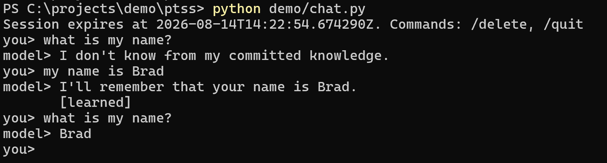

# Compsmart CLM

Compsmart CLM is a confidential, self-contained continual-learning model
preview. It can learn selected facts and small text skills during ordinary
inference, retain them across later interactions, and recall them through new
wording without retraining by the tester.

The published frozen black-box run passed 103/106 checks. It accepted eight
facts and two of three requested text skills, passed all 67 sequential
preservation probes with zero observed regressions, passed all 10 held-out
probes for accepted lessons, and retained all 10 accepted lessons after a fresh
process reload. The refused lesson and its two consequent failures are fully
disclosed in [RESULTS.md](RESULTS.md).

This repository intentionally contains **verification material only**. It does
not contain model weights, executable model samples, server code, prompts,
architecture, training material, state files, or implementation details. This
boundary protects ongoing confidential research and prevents published samples
from disclosing how the capability is implemented.

## Try the hosted model

The public preview is available at `https://clm.compsmart.cloud`.

```powershell
python demo/chat.py
```

The chat client resumes its anonymous session after `/quit`, so facts remain
available when the command is run again. Use `/delete` to delete that session
or `--new-session` to deliberately start a separate one. Anonymous sessions
still expire within 24 hours.



The screenshot shows a fresh session first reporting that it does not know the
user's name, then learning `Brad` from ordinary conversation and recalling it
on the next request.

Example:

```text
you> My name is Rowan.
model> I'll remember that your name is Rowan.
you> What is my name?
model> Rowan
you> Do you remember what I am called?
model> Rowan
```

Run the randomized behavioral verifier:

```powershell
python demo/verify_live.py
```

Verify the published evidence and its hashes without contacting the service:

```powershell
python demo/verify_evidence.py
```

## What is and is not claimed

The preview demonstrates bounded continual learning for the documented fact
and text-skill tasks, persistence, paraphrase generalization, correction,
isolation, and preservation checks. It does not claim universal continual
learning, arbitrary skill acquisition, truth verification, unlimited memory,
or guaranteed answers to every paraphrase.

See [demo/README.md](demo/README.md) for runnable examples, [RESULTS.md](RESULTS.md)
for the evidence summary, and [VERIFY.md](VERIFY.md) plus
[CHALLENGE_PROTOCOL.md](CHALLENGE_PROTOCOL.md) for the precise public contract.

The code in this repository is licensed under Apache-2.0. That license does not
grant access to, or rights in, the confidential hosted model or runtime.
